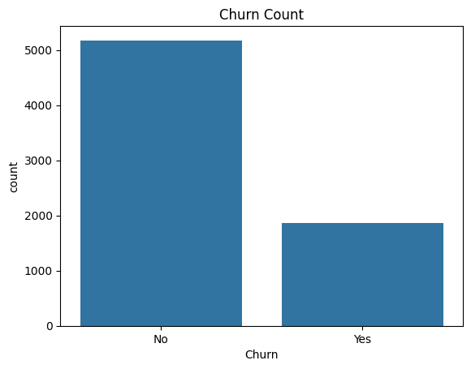
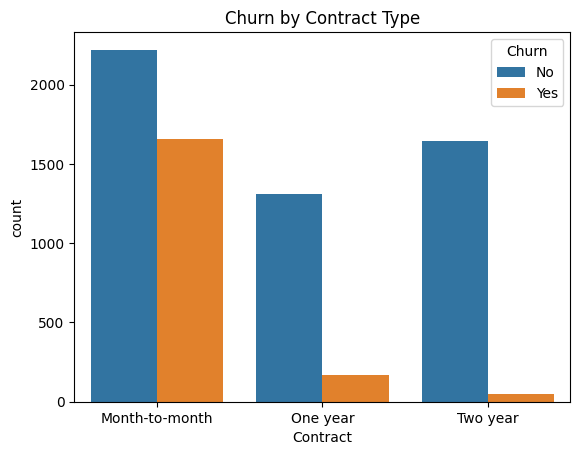
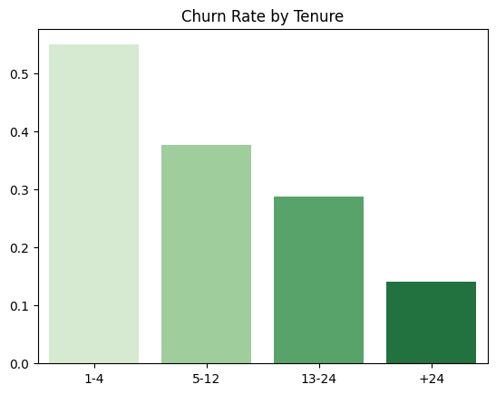
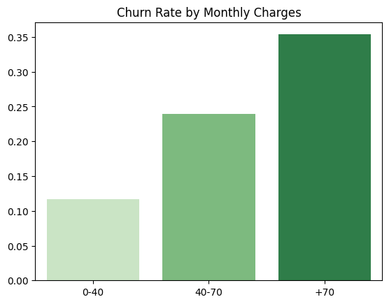
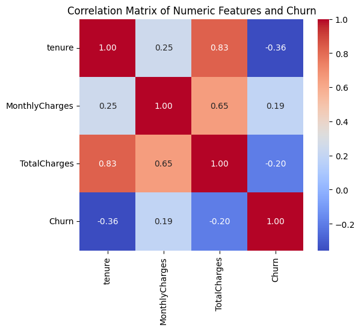
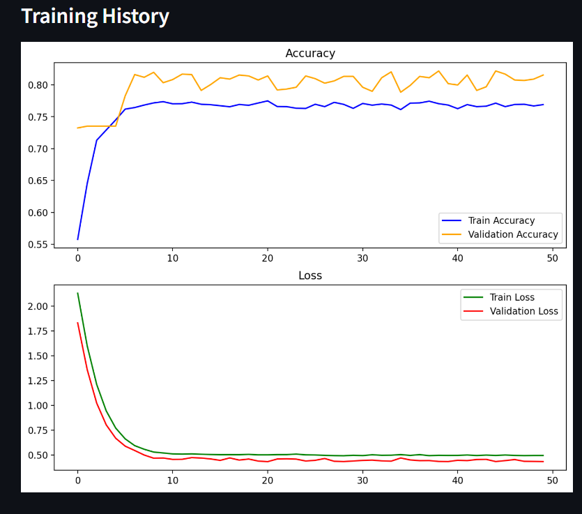
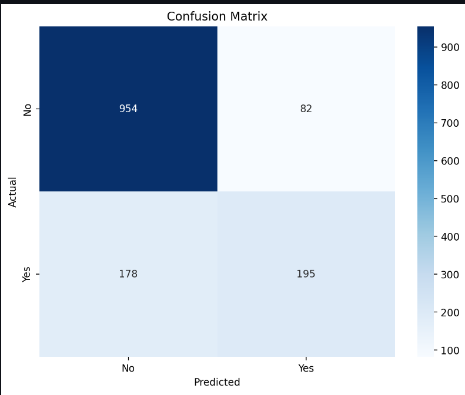

# Customer-Churn_Predict
1.	Introduction
Customer churn refers to the situation where customers stop doing business with a company. Predicting churn is crucial for retaining customers, especially in highly competitive industries such as telecommunications. In this project, the goal is to analyze customer data from a telecom company and predict the likelihood of customers churning based on various features such as contract type, tenure, monthly charges, and more. This report outlines the steps taken to preprocess the data, explore it, build predictive models, and evaluate their performance.

2.	Data Overview
The dataset used for this analysis is the "Telco Customer Churn" dataset. It contains the following columns:
Customer Information: Gender, Senior Citizen, Partner, Dependents
Service Information: Phone service, Multiple lines, Internet service, Online security, Online backup, Device protection, Tech support, Streaming TV, Streaming movies
Account Information: Tenure, Contract, Paperless billing, Payment method, Monthly charges, Total charges
Target Variable: Churn (Whether the customer left in the last month)

2.1.	Dataset Summary
2.1.1.	Total records: 7,043
2.1.2.	Target variable: Churn (binary classification)
2.1.3.	Numerical columns: Tenure, MonthlyCharges, TotalCharges
2.1.4.	Categorical columns: Service and account-related features, including contract type, payment method, etc.

3.	Data Preprocessing
3.1.	Missing Values
3.1.1.	We observed missing values in the TotalCharges column due to spaces (' '), which were coerced into NaN using pd.to_numeric and then imputed with the median value. No other missing values were present.
3.2.	Data Transformation
3.2.1.	Churn: Converted the Churn column into binary integers                                        (1 for "Yes", 0 for "No").
3.2.2.	Categorical Columns: One-hot encoding was applied to transform categorical variables into numerical format for model training.
3.2.3.	Numerical Columns: Features like TotalCharges, MonthlyCharges, and tenure were standardized using StandardScaler.
3.3.	Train-Test Split
3.3.1.	The data was split into three sets:
3.3.2.	60% Training: Model building
3.3.3.	20% Validation: Model tuning
3.3.4.	20% Testing: Final model evaluation
4.	Exploratory Data Analysis (EDA)
4.1.	Churn 
4.1.1.	We visualized the distribution of the Churn column using a count plot:
4.1.2.	Around 27% of the customers in the dataset have churned, while 73% have remained.

4.2.	 Churn by Contract Type
4.2.1.	The contract type has a strong influence on customer churn. We plotted the churn rate based on contract type:
4.2.2.	Month-to-month contracts have a significantly higher churn rate compared to longer-term contracts

4.3.	Tenure and Churn
4.3.1.	The churn rate decreases as tenure increases. We segmented the tenure into groups to visualize the churn rate for different tenure groups:
4.3.2.	Tenure 1-4 months: Highest churn rate
4.3.3.	Tenure 5-12 months: Moderate churn rate
4.3.4.	Tenure 13-24 months: Lower churn rate
4.3.5.	Tenure > 24 months: Lowest churn rate

4.4.	Monthly Charges and Churn

4.4.1.	The churn rate is higher for customers with higher monthly charges. Customers with monthly charges above $70 have the highest churn rate.

4.5.	Correlation Analysis

4.5.1.	A heatmap was used to visualize the correlation between the numerical features and churn:
4.5.2.	The correlation between Churn and numerical features is relatively weak, but MonthlyCharges and tenure show a notable relationship.

5.	Data Preparation:
5.1.	The input features are stored in X_transformed, and the target variable is df['Churn'].
5.2.	The dataset is split into training and testing sets using a 75%-25% split.
6.	Model Architecture:
6.1.	The model is built using Keras' Sequential API with thefollowing layers:
6.2.	Input Layer: A dense layer with 16 units, ReLU activation, and L1-L2 regularization.
6.3.	Hidden Layers:
6.3.1.	Three additional dense layers with 8, 4, and 2 units, respectively, each followed by Batch Normalization and Dropout for regularization.
6.4.	Output Layer: A single neuron with a sigmoid activation function, suitable for binary classification.
7.	Model Compilation:
7.1.	The model is compiled using the Adam optimizer, binary cross-entropy loss function, and accuracy as the evaluation metric.
8.	Training the Model:
8.1.	The user can initiate model training by clicking the "Train Model" button.
8.2.	Training occurs for 50 epochs with a batch size of 32, and validation data is provided for tracking performance.
8.3.	The training history (accuracy and loss) is plotted and displayed after training.
9.	Model Evaluation:
9.1.	After training, the model’s accuracy is evaluated on the test set.
9.2.	A classification report is generated, providing precision, recall, and F1-score metrics, which is displayed in a DataFrame format.

10.	Confusion Matrix Visualization:

10.1.	The confusion matrix is computed and visualized using Seaborn's heatmap functionality, displaying the model's performance in a more intuitive manner.

11.	K-Fold Cross-Validation:
11.1.	The application allows for K-Fold Cross-Validation (with 5 splits) when the "Train by K-Fold Cross-Validation" button is clicked.
11.2.	The model is retrained for each fold, and accuracies and classification reports for each fold are collected and displayed.
11.3.	The average accuracy across all folds is computed and displayed to give an overall sense of model performance.
12.	Model Saving:
12.1.	The trained model is saved as a pickle file, allowing for future use or deployment.
13.	Visualization of Results
13.1.	The application generates visualizations of:
13.1.1.	Training History: Accuracy and loss curves for both training and validation sets.
13.1.2.	Confusion Matrix: A heatmap indicating true positives, false positives, true negatives, and false negatives.

Conclusion	
	In this project, we successfully explored and preprocessed the telecom churn dataset. Key factors that influence customer churn include the contract type, tenure, and monthly charges. A logistic regression model was trained, and its performance was improved using PyCaret's automated tuning. The final model achieved an accuracy of 80% on the test data, making it a useful tool for predicting customer churn.
